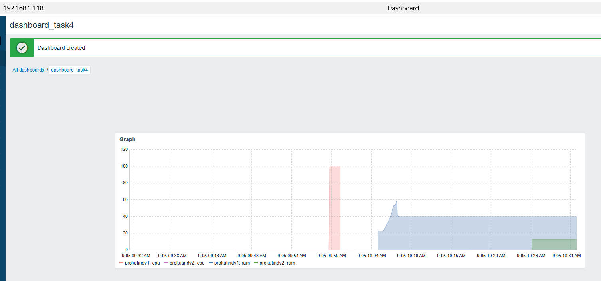

# Домашнее задание к занятию "`Система мониторинга Zabbix. Часть 2`" - `Прокутин ДВ`

1. [Руководство по оформлению Markdown файлов](https://gist.github.com/Jekins/2bf2d0638163f1294637#Code)

---

### Задание 1

`Создайте свой шаблон, в котором будут элементы данных, мониторящие загрузку CPU и RAM хоста`

---

### Задание 2

`Добавьте в Zabbix два хоста и задайте им имена <фамилия и инициалы-1> и <фамилия и инициалы-2>. Например: ivanovii-1 и ivanovii-2.`

### Задание 3

`Привяжите созданный шаблон к двум хостам. Также привяжите к обоим хостам шаблон Linux by Zabbix Agent.`

### Задание 4

`Создайте свой кастомный дашборд.`

